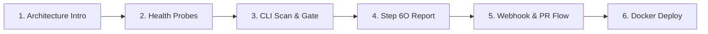

# CodeSentinel

> **An AI-powered static security analysis platform for GitHub repositories.**

CodeSentinel delivers automated, non-executing static security analysis for codebases and pull requests. By synthesizing Tree-sitter AST structural analysis, a hybrid Retrieval-Augmented Generation (RAG) security knowledge base, and Large Language Model (LLM) vulnerability reasoning, CodeSentinel detects security vulnerabilities, generates structured Step 6O production reports, and enforces deterministic, fail-closed security gates in CI/CD workflows and GitHub PR integrations.

---

## 1. Project Status

| Metric | Status / Verified Baseline |
| :--- | :--- |
| **Release Version** | `1.1.0` |
| **API Version** | `v1` |
| **Development Series** | 6-Series Complete |
| **Security Gate Baseline** | `ALLOW` — 0 findings on production repository scan |
| **Regression Test Baseline** | `469 passed / 0 failed` (current verified baseline) |
| **Frontend UI** | Production build verified (`frontend/dist/`) |
| **Containerization** | Verified Docker multi-stage build, runtime, and Docker Compose (`codesentinel:1.1.0`) |
| **Current Commit** | `16799eb` |

---

## 2. Features

- **Static AST Security Analysis**: Language-aware AST structural inspection and security rule matching powered by Tree-sitter. Code is treated strictly as static text without compilation, dynamic evaluation, or runtime execution.
- **Vector & Knowledge Base Foundation**: Embedded security domain knowledge base spanning OWASP Top 10, CWE patterns, and common vulnerability signatures stored in Chroma vector store.
- **Hybrid RAG Retrieval**: Multi-modal retrieval combining semantic vector similarity search with keyword/heuristic matching for relevant vulnerability context retrieval.
- **Ranking & Deduplication**: Confidence-based ranking, score thresholding, and AST-to-evidence deduplication pipeline.
- **Security Context Assembly**: Token-aware contextual assembly bringing together AST code signals, retrieved vulnerability intelligence, and repository metadata for LLM prompt ingestion.
- **LLM Security Analysis**: Vulnerability reasoning engine utilizing Groq (Llama 3 70B) with automated fallback to local Ollama (CodeLlama) for structured vulnerability evaluation and remediation suggestions.
- **Analysis Orchestration**: Unified multi-phase pipeline synchronizing intake, AST parsing, RAG querying, LLM invocation, finding normalization, and reporting.
- **Persistence & History**: Persistent storage of complete analysis records, summaries, and individual findings with pagination, filtering, and cascading deletion.
- **GitHub Repository Validation & Acquisition**: Secure GitHub URL validation, repository metadata extraction, and safe isolated local workspace acquisition.
- **Finding Aggregation & Production Reports**: Full Step 6O Production Security Report schema generation with severity tallies, categorization, confidence scoring, and line-level evidence markers.
- **GitHub Integration**: Ingress webhook processing (pull request events), GitHub Check Runs API, commit status updates, and formatted PR markdown security commenting.
- **Webhook Security**: Cryptographic HMAC-SHA256 signature verification (`X-Hub-Signature-256`) against configured webhook secrets.
- **CI/CD Security Scanning**: Standalone headless scanning mode for integration into automated build and deployment pipelines.
- **Automated Security Gate**: Fail-closed policy evaluator returning deterministic status codes (`ALLOW`, `REVIEW`, `BLOCK`, `INVALID`).
- **Policy Profiles**: Configurable security threshold profiles (`default`, `strict`, `ci`, `developer`).
- **Scope & Exclusion Controls**: Automatic exclusion of build artifacts, test directories, package managers, virtual environments, and path normalization against traversal attacks.
- **Incremental Analysis**: Git-diff aware file inspection filtering out unchanged files to accelerate scanning on incremental commits.
- **Observability & Health Checks**: Secret-safe platform health (`/platform/health`), readiness (`/platform/readiness`), release readiness (`/platform/readiness/release`), capability info (`/platform/info`), and internal telemetry metrics (`/platform/metrics`).
- **Security Analytics V2 & Telemetry**: Server-side historical posture analytics (`/analytics/summary`, `/analytics/vulnerabilities`, `/analytics/repositories`, `/analytics/suppressions`, `/platform/developers`) featuring bounded time-window filtering (`7d`, `30d`, `90d`, `all`), severity distributions, top CWE categories, multi-repository risk tracking, and false-positive suppression telemetry with dynamically derived expiration.
- **Unified CLI**: Comprehensive command-line interface for local developer scanning, CI gate checks, report formatting, and platform diagnostics.
- **Production Containerization**: Hardened, multi-stage non-root Docker container deployment (`codesentinel:1.1.0`) with Docker Compose support.

---

## 3. Architecture

### Static Security Analysis Pipeline

```
Repository Source / PR Diff
             │
             ▼
 GitHub Validation / Acquisition
             │
             ▼
 Scope & Exclusion Filtering (.git, node_modules, tests, etc.)
             │
             ▼
 Incremental Filtering (Git diff / changed-files detection)
             │
             ▼
 Tree-sitter AST Static Analysis (Structural rules & syntax extraction)
             │
             ▼
 Hybrid RAG Retrieval (Chroma vector search + CWE/OWASP knowledge base)
             │
             ▼
 Security Context Assembly (Evidence bundling & token-budget enforcement)
             │
             ▼
 LLM Security Analysis (Groq Llama 3 70B / Ollama CodeLlama fallback)
             │
             ▼
 Finding Aggregation / Normalization (Deduplication & severity classification)
             │
             ▼
 Step 6O Production Report (Normalized contract with line-level evidence)
             │
             ▼
 CI Security Gate (ALLOW = 0, REVIEW = 2, BLOCK = 1, INVALID = 1)
             │
             ▼
 GitHub Checks / Commit Status / PR Comment / CI Summary
```

### Core Components

1. **Repository Intake & Acquisition (`backend/repository`)**: Validates repository coordinates, clones or links local workspaces, and computes file metadata while guaranteeing zero execution of target code.
2. **Scope Engine (`backend/analysis/scope.py`)**: Filters out build outputs, dependencies, vendor libraries, and test directories. Normalizes relative paths to block directory escape and traversal attempts.
3. **AST Static Engine (`ast_engine`)**: Parses source code into Tree-sitter syntax trees to detect unsafe functions, insecure imports, hardcoded secret assignments, and pattern violations without code execution.
4. **Hybrid RAG Service (`rag`)**: Queries embedded CWE/OWASP vulnerability records using vector embeddings stored in ChromaDB combined with keyword heuristics.
5. **LLM Analyzer (`llm`)**: Constructs bounded prompt contexts and executes structured vulnerability analysis using Groq cloud models with local Ollama fallback.
6. **Report Service (`backend/analysis/report_service.py`)**: Assembles and validates the canonical Step 6O Production Security Report contract.
7. **Security Gate (`backend/analysis/security_gate.py`)**: Deterministically enforces release and build policies based on finding severities.
8. **GitHub Orchestrator (`backend/github`)**: Manages webhook verification, PR diff retrieval, status check publishing, and PR review comments.
9. **Security Analytics Engine (`backend/analysis/storage/store.py`, `backend/app/api/analytics.py`)**: High-performance SQLite-indexed aggregation layer providing historical posture metrics, vulnerability categorization, repository risk distribution, and suppression intelligence without mutating analysis findings or participating in gate evaluations.

### Security Analytics V2 Architectural Contract

The Security Analytics V2 subsystem operates strictly in an observational, downstream capacity:

```
Frontend Command Center (Preset Windows: 7D / 30D / 90D / ALL)
           │
           │ HTTP REST (/analytics/*, /platform/developers)
           ▼
FastAPI Analytics Router (backend/app/api/analytics.py)
           │
           ▼
AnalysisStore Engine (backend/analysis/storage/store.py)
           │
           ▼
Native SQLite Database (Indexed SQL Aggregations)
```

> [!IMPORTANT]
> **STRICT OBSERVATIONAL SEPARATION GUARANTEE**
> Analytics endpoints are strictly read-only. The analytics subsystem does **NOT** participate in:
> - Deterministic finding generation
> - Tree-sitter AST structural analysis
> - Bounded taint propagation analysis
> - Step 6O production report generation or validation
> - Step 6O security gate evaluation (`evaluate_security_gate`)
> - LLM security reasoning or prompt construction
> - RAG vector retrieval or knowledge-base indexing
> - GitHub review commenting or check-run publishing
>
> Target code is never executed, findings are never mutated, and gate policies remain 100% deterministic and isolated.

---

## 4. Security Model

CodeSentinel is designed with defensive software engineering and least-privilege principles:

- **Static Non-Execution**: Analyzed code is parsed as immutable data; no scripts, modules, or binaries are executed.
- **Request Size Limits**: Ingress payload size is bounded via middleware (`MAX_REQUEST_SIZE_BYTES`, default 10MB) to mitigate denial-of-service (DoS) vectors.
- **HTTP Security Headers**: Strict security headers injected on all HTTP responses:
  - `Strict-Transport-Security: max-age=31536000; includeSubDomains`
  - `X-Content-Type-Options: nosniff`
  - `X-Frame-Options: DENY`
  - `Content-Security-Policy: default-src 'self'`
- **CORS Hardening**: Explicit origin whitelisting (`ALLOWED_ORIGINS`). Wildcard (`*`) CORS origins are disallowed in production configuration.
- **Exception Sanitization**: Global exception handlers intercept unhandled errors and return generic error messages, preventing stack trace or internal environment leakage.
- **Secret Redaction**: Automated masking in logs, CLI terminal output, and API responses replaces sensitive tokens (`GROQ_API_KEY`, `GITHUB_TOKEN`, `GITHUB_WEBHOOK_SECRET`, `DATABASE_URL`) with `[REDACTED]`.
- **Production Configuration Validation**: The application startup validates settings to ensure `DEBUG=False` in `APP_ENV=production`, port numbers are within valid ranges (1–65535), and placeholder credentials are rejected.
- **Path Traversal Protection**: All paths are resolved and verified against the repository root; attempts to escape the root boundary via `..` segments or directory traversal raise explicit validation errors.
- **Webhook Authentication**: All GitHub webhook deliveries must pass cryptographic HMAC-SHA256 signature verification matching `X-Hub-Signature-256`.
- **Fail-Closed Security Gate**: Any malformed report, conflicting status, or unhandled exception immediately results in an `INVALID` (exit code 1) failure, preventing unverified code from bypassing CI.
- **Observational Analytics Immutability**: All analytics operations are strictly read-only and query-driven via parameterized SQL. Analytics endpoints never mutate findings, never mutate suppressions, never invoke `evaluate_security_gate()`, never alter finding severities, confidences, or taint tracking states, and never leak source code snippets, evidence excerpts, or secrets.
- **Derived Suppression Lifecycle Semantics**:
  - `ACTIVE`: A reviewed suppression whose `expires_at` timestamp is `None` or in the future.
  - `EXPIRED`: State is **dynamically derived at query time** by comparing `expires_at` against current UTC time. The database row status is **never mutated** to `EXPIRED`, preserving immutable audit history.
  - `REVOKED`: A suppression explicitly revoked by security administrators.
  - Legacy v1 suppressions lacking expiration timestamps fail-closed.
- **Container Isolation**: Multi-stage Docker image runs as unprivileged user `codesentinel` (UID 1000, GID 1000).

### Security Gate Exit Decisions

The CI security gate enforces deterministic outcomes:

| Gate Decision | Exit Code | Condition | Meaning |
| :--- | :---: | :--- | :--- |
| **`ALLOW`** | `0` | `critical == 0`, `high == 0`, `medium == 0` | Scan passed clean; pipeline continues. |
| **`REVIEW`** | `2` | `critical == 0`, `high == 0`, `medium > 0` | Moderate findings present; manual review required before merge. |
| **`BLOCK`** | `1` | `critical > 0` or `high > 0` | Serious vulnerabilities detected; pipeline fails and blocks merge. |
| **`INVALID`** | `1` | Malformed JSON, schema violation, or status mismatch | Report validation failure; fails closed immediately. |

---

## 5. Security Scan Scope

Production scans inspect legitimate source code while intentionally bypassing non-production and transient artifacts:

### Default Excluded Directories

```
.git          node_modules     dist            build           __pycache__
.pytest_cache .venv            venv            .env            .ds_store
coverage      .idea            .vscode         tests           test
```

### Default Excluded File Patterns

```
*.pyc   *.pyo   *.pyd   *.so   *.dll   *.exe   *.dylib   *.min.js   *.min.css   *.map
```

### Scope Handling Design

- **Test Fixture Isolation**: Test suites (`tests/`, `test/`) frequently contain intentional vulnerability fixtures used for regression testing. These directories are strictly excluded from production repository scans while remaining active during regression test runs.
- **Path Traversal Normalization**: Relative path handling strips redundant separators and resolves relative traversal segments (e.g., `tests/../src/app.py` resolves to `src/app.py`, and `src/../tests/fixture.py` correctly resolves to `tests/fixture.py` and is excluded).
- **Scope Boundary Note**: Scope normalization ensures that files analyzed match legitimate repository source code; it operates on repository-relative paths and does not replace operating-system filesystem permissions.

---

## 6. Installation & Local Setup

### Prerequisites

- **Python**: Python 3.10 or 3.11
- **Node.js**: Node.js 18+ and npm
- **Git**: 2.30+
- **Docker** (Optional, for containerized execution): Docker 24+ and Docker Compose v2+

### Step 1: Clone Repository

```bash
git clone https://github.com/SARUKKESH-M/S5-MINI-PROJECT.git
cd S5-MINI-PROJECT
```

### Step 2: Set Up Python Virtual Environment

**Windows (PowerShell):**
```powershell
python -m venv backend\.venv
backend\.venv\Scripts\Activate.ps1
python -m pip install --upgrade pip
pip install -r backend\requirements.txt
```

**Linux / macOS:**
```bash
python3 -m venv backend/.venv
source backend/.venv/bin/activate
pip install --upgrade pip
pip install -r backend/requirements.txt
```

### Step 3: Install Frontend Dependencies

```bash
cd frontend
npm install
cd ..
```

### Step 4: Environment Configuration

Copy the example configuration file:

**Windows:**
```powershell
copy .env.example .env
```

**Linux / macOS:**
```bash
cp .env.example .env
```

Configure your `.env` variables as needed (see [Environment Variables](#7-environment-variables)).

### Step 5: Verify Installation

Run the test suite to verify baseline functionality:

**Windows:**
```powershell
backend\.venv\Scripts\python.exe -m pytest -q
```

---

## 7. Environment Variables

The table below summarizes all environment variables recognized by CodeSentinel across `backend/app/core/config.py`, `.env.example`, and container configurations:

| Variable | Purpose | Secret? | Required? | Environment | Default / Notes |
| :--- | :--- | :---: | :---: | :--- | :--- |
| `APP_ENV` | Application environment lifecycle | No | No | Dev / Staging / Prod | `development` (Docker sets `production`) |
| `DEBUG` | Application debug mode | No | No | Dev / Prod | `False` (**Must be `False` in production**) |
| `LOG_LEVEL` | Python logging severity level | No | No | All | `info` |
| `BACKEND_HOST` | FastAPI uvicorn host bind address | No | No | All | `0.0.0.0` |
| `BACKEND_PORT` | FastAPI uvicorn port | No | No | All | `8000` |
| `ALLOWED_ORIGINS` | Comma-separated list of allowed CORS origins | No | No | All | `http://localhost:3000,http://127.0.0.1:3000,http://localhost:8000,http://127.0.0.1:8000` |
| `MAX_REQUEST_SIZE_BYTES` | Maximum allowed HTTP request payload size in bytes | No | No | All | `10485760` (10 MB) |
| `ENABLE_SECURITY_HEADERS` | Toggles security response headers middleware | No | No | All | `True` |
| `GROQ_API_KEY` | Primary Groq LLM API authorization key | **Yes** | Optional* | All | Used for cloud LLM security analysis (*required if cloud LLM is used) |
| `GROQ_MODEL` | Groq model identifier | No | No | All | `llama3-70b-8192` |
| `OLLAMA_BASE_URL` | Local fallback Ollama endpoint URL | No | No | All | `http://localhost:11434` |
| `OLLAMA_MODEL` | Local fallback Ollama model identifier | No | No | All | `codellama` |
| `GITHUB_TOKEN` | GitHub Personal Access Token for PR status & comments | **Yes** | Optional* | Staging / Prod | Required for posting GitHub Check Runs and comments |
| `GITHUB_WEBHOOK_SECRET` | HMAC-SHA256 secret for validating webhook payloads | **Yes** | Optional* | Staging / Prod | Required when exposing `POST /github/webhook` |
| `GITHUB_API_BASE_URL` | GitHub REST API endpoint URL | No | No | All | `https://api.github.com` |
| `GITHUB_API_VERSION` | GitHub API version header | No | No | All | `2022-11-28` |
| `DATABASE_URL` | PostgreSQL connection string | **Yes** | Optional | Staging / Prod | Optional database persistence URL |
| `REDIS_URL` | Redis cache and queue connection string | **Yes** | Optional | Staging / Prod | Optional background worker queue URL |
| `SLACK_WEBHOOK_URL` | Slack incoming webhook for alerts | **Yes** | Optional | Staging / Prod | Optional external alerting channel |
| `CHROMA_DB_PATH` | Directory path for persistent Chroma vector store | No | No | All | `./data/chroma` (Docker: `/app/data/chroma`) |

---

## 8. Unified CLI Guide

CodeSentinel includes a unified Command Line Interface accessible via `python -m cli <command>`.

### CLI Commands

| Command | Purpose | Example |
| :--- | :--- | :--- |
| `scan` | Run an automated static security scan and output a Step 6O report | `python -m cli scan --target-dir . --policy default` |
| `analyze` | Execute static analysis on a target directory with filtering controls | `python -m cli analyze --target-dir . --mode full --output report.json` |
| `gate` | Evaluate a Step 6O report against CI security gate policies | `python -m cli gate --report security-report.json` |
| `report` | Format and display a Step 6O report in terminal, markdown, or JSON | `python -m cli report --input report.json --format terminal` |
| `health` | Display platform component health diagnostics | `python -m cli health` |
| `readiness` | Verify application readiness status | `python -m cli readiness` |
| `info` | Display platform version and enabled capabilities | `python -m cli info` |
| `policies` | List available security analysis policy profiles | `python -m cli policies` |
| `metrics` | Display internal observability metrics | `python -m cli metrics` |
| `version` | Display CodeSentinel CLI version information | `python -m cli version` |

### CLI Options

- `-t, --target-dir <PATH>`: Target repository directory (default: `.`)
- `-p, --policy {default,strict,ci,developer}`: Security analysis policy profile (default: `default`)
- `-m, --mode {full,incremental}`: Analysis mode for `analyze` (default: `full`)
- `--changed-files <LIST>`: Comma-separated list of changed file paths for incremental analysis
- `-e, --exclude <PATTERNS>`: Comma-separated fnmatch exclude glob patterns
- `-o, --output <PATH>`: Destination file path for generated JSON/text reports
- `-r, --report <PATH>`: Input Step 6O report JSON path for the `gate` command
- `-i, --input <PATH>`: Input report file path for the `report` command
- `-f, --format {terminal,markdown,json}`: Output formatting style for `report` (default: `terminal`)
- `--json`: Format command output directly as raw JSON
- `-v, --verbose`: Enable verbose logging output
- `-q, --quiet`: Suppress non-essential output

---

## 9. API Reference

CodeSentinel exposes a FastAPI REST API running on port `8000`.

### Interactive API Documentation

When the backend is running, interactive API exploration and OpenAPI schemas are accessible at:
- **Swagger UI**: `http://localhost:8000/docs`
- **ReDoc**: `http://localhost:8000/redoc`

### Endpoints

#### Platform & Diagnostics

- **`GET /`**
  - **Purpose**: Root service identification.
  - **Parameters**: None.
  - **Response**: `{"status": "ok", "service": "CodeSentinel"}`

- **`GET /health`**
  - **Purpose**: Fast, unauthenticated liveness check.
  - **Parameters**: None.
  - **Response**: `{"status": "healthy"}`

- **`GET /platform/health`**
  - **Purpose**: Diagnostic platform health summary checking storage, vector store, and LLM connectivity.
  - **Parameters**: None.
  - **Response**: Health summary object with individual component statuses (`healthy`, `degraded`, or `unhealthy`).

- **`GET /platform/readiness`**
  - **Purpose**: Service readiness probe for container orchestrators.
  - **Parameters**: None.
  - **Response**: `{"ready": true, "status": "ready"}`

- **`GET /platform/readiness/release`**
  - **Purpose**: Comprehensive 6-series release readiness verification checking all subsystems, policies, and gate rules.
  - **Parameters**: None.
  - **Response**: Detailed verification status with `release_ready: true/false` and subsystem checklists.

- **`GET /platform/info`**
  - **Purpose**: Platform metadata, version, and enabled capability list.
  - **Parameters**: None.
  - **Response**: `{"service": "CodeSentinel", "version": "1.1.0", "api_version": "v1", "enabled_capabilities": [...]}`

- **`GET /platform/policies`**
  - **Purpose**: Retrieves all available security analysis policy profiles.
  - **Parameters**: None.
  - **Response**: Array of policy profile objects (`default`, `strict`, `ci`, `developer`) with thresholds and actions.

- **`GET /platform/metrics`**
  - **Purpose**: Retrieves internal observability counters and execution metrics.
  - **Parameters**: None.
  - **Response**: JSON map of recorded telemetry metrics (e.g., `scans_total`, `health_checks_total`).

- **`GET /platform/developers`**
  - **Purpose**: Retrieves developer security analytics and activity posture aggregated from historical analyses.
  - **Parameters**: `time_window` (optional string: `7d`, `30d`, `90d`, `all`), `repository` (optional string), `limit` (int, 1–100, default: 50).
  - **Response**: `{"status": "success", "developers": [{"author": "...", "analysis_count": int, "finding_count": int, "severities": {...}, "last_activity": "..."}, ...]}`

#### Analysis Operations

- **`POST /analyze`**
  - **Purpose**: Executes the complete static analysis pipeline on submitted raw source code.
  - **Request Body**: `{"source_code": "string", "query": "string"}`
  - **Response**: Sanitized analysis result dictionary containing findings, severity breakdown, and execution metadata. Returns `400 Bad Request` if source code exceeds size limits.

- **`POST /repository/intake`**
  - **Purpose**: Validates repository URL and prepares local directory intake.
  - **Request Body**: `{"repository_url": "string", "branch": "string", "path": "string", "local_path": "string"}`
  - **Response**: Public repository metadata only. Raw source code is strictly excluded.

- **`POST /repository/acquire`**
  - **Purpose**: Performs controlled local workspace acquisition for a repository.
  - **Request Body**: `{"repository_url": "string", "branch": "string", "path": "string", "local_path": "string"}`
  - **Response**: Acquisition record including `acquisition_id` and workspace path metadata.

- **`POST /repository/analyze`**
  - **Purpose**: Executes multi-file static analysis on an acquired workspace.
  - **Request Body**: `{"acquisition_id": "string", "query": "string"}`
  - **Response**: Multi-file analysis findings, summary counts, and sanitized execution traces.

- **`GET /repository/reports/{analysis_id}`**
  - **Purpose**: Retrieves the formatted Step 6O Production Security Report contract for an analysis.
  - **Parameters**: `analysis_id` (path string).
  - **Response**: Full Step 6O Production Report schema. Returns `404` if not found, `400` if ID is malformed.

#### Analysis History & Persistence

- **`GET /analyses`**
  - **Purpose**: Retrieves paginated list of historical security analysis summary records.
  - **Parameters**: `limit` (int, default 20), `offset` (int, default 0).
  - **Response**: `{"status": "success", "analyses": [...], "analysis_count": int, "total_count": int}`

- **`GET /analyses/{analysis_id}`**
  - **Purpose**: Retrieves a single historical analysis record including full findings.
  - **Parameters**: `analysis_id` (path string).
  - **Response**: Historical analysis record. Returns `404` if not found.

- **`GET /analyses/{analysis_id}/findings`**
  - **Purpose**: Retrieves findings list for a specific analysis record.
  - **Parameters**: `analysis_id` (path string).
  - **Response**: Array of findings for the requested analysis ID.

- **`DELETE /analyses/{analysis_id}`**
  - **Purpose**: Deletes an analysis record and cascades deletion to associated findings.
  - **Parameters**: `analysis_id` (path string).
  - **Response**: `{"status": "success", "analysis_id": "...", "deleted": true}`

#### Security Analytics V2 & Posture Telemetry

- **`GET /analytics/summary`**
  - **Purpose**: Consolidated historical security summary metrics.
  - **Parameters**: `time_window` (`7d`, `30d`, `90d`, `all`; default: `30d`), `repository_id` (optional string).
  - **Response**: Summary object containing `total_analyses`, `total_findings`, severity tallies (`critical`, `high`, `medium`, `low`, `info`), `review_status` gate breakdown, and `suppressions` summary.

- **`GET /analytics/vulnerabilities`**
  - **Purpose**: Server-side vulnerability and CWE category aggregation with severity breakdown and deterministic ordering.
  - **Parameters**: `time_window` (`7d`, `30d`, `90d`, `all`; default: `30d`), `repository_id` (optional string), `limit` (int, 1–100, default: 10).
  - **Response**: Array of vulnerability categories with aggregated occurrence counts and per-category severity breakdowns.

- **`GET /analytics/repositories`**
  - **Purpose**: Repository-level security posture aggregation.
  - **Parameters**: `time_window` (`7d`, `30d`, `90d`, `all`; default: `30d`), `limit` (int, 1–100, default: 20).
  - **Response**: Array of repository risk records containing `repository_id`, `analysis_count`, `finding_count`, severity breakdown, and `last_analyzed` ISO timestamp.

- **`GET /analytics/suppressions`**
  - **Purpose**: False-positive suppression intelligence telemetry.
  - **Parameters**: `time_window` (`7d`, `30d`, `90d`, `all`; default: `30d`), `repository_id` (optional string).
  - **Response**: Telemetry object containing `total_suppressions`, `active_count`, `expired_count`, `revoked_count`, reason-code distribution (`by_reason`), and fingerprint version distribution (`by_fingerprint_version`). Expiration is derived dynamically at query time; underlying rows remain immutable.

#### GitHub Webhooks

- **`POST /github/webhook`**
  - **Purpose**: Ingress endpoint for GitHub webhook events (`pull_request`).
  - **Headers**: `X-Hub-Signature-256` (HMAC signature), `X-GitHub-Event` (event type), `X-GitHub-Delivery` (delivery GUID).
  - **Request Body**: Raw GitHub webhook JSON payload.
  - **Response**: Webhook orchestration outcome dictionary. Verifies HMAC-SHA256 signature when secret is configured; returns `401 Unauthorized` on invalid signature.

---

## 10. Docker Deployment

CodeSentinel is containerized using a hardened multi-stage Dockerfile adhering to production security standards:

- **Canonical Image**: `codesentinel:1.1.0`
- **Listening Port**: `8000`
- **Runtime User**: Unprivileged user `codesentinel` (UID `1000`, GID `1000`)
- **Environment**: `APP_ENV=production`, `DEBUG=False`
- **Python Path**: `PYTHONPATH="/app:/app/backend"`
- **Health Probe**: `GET http://localhost:8000/platform/health`
- **Readiness Probe**: `GET http://localhost:8000/platform/readiness`
- **Release Readiness Probe**: `GET http://localhost:8000/platform/readiness/release`
- **Data Volume**: `codesentinel-data` mounted at `/app/data`

### Build Docker Image

```bash
docker build -t codesentinel:1.1.0 .
```

### Run Standalone Container

```bash
docker run -d \
  --name codesentinel-backend \
  -p 8000:8000 \
  -e APP_ENV=production \
  -e DEBUG=False \
  -e ALLOWED_ORIGINS="http://localhost:3000" \
  -e GROQ_API_KEY="your_groq_api_key_placeholder" \
  -v codesentinel-data:/app/data \
  codesentinel:1.1.0
```

### Deploy via Docker Compose

```bash
# Start backend service in detached mode
docker compose up -d

# Check running container status and health
docker compose ps

# Follow container logs
docker compose logs -f backend

# Stop and remove containers
docker compose down
```

---

## 11. Testing & Verification

CodeSentinel maintains a regression test suite covering all modules: AST parsing, hybrid RAG, LLM analysis, repository intake, report contracts, security gate evaluation, and CLI commands.

### Running Regression Tests

**Windows (PowerShell):**
```powershell
backend\.venv\Scripts\python.exe -m pytest -q
```

**Linux / macOS:**
```bash
backend/.venv/bin/python -m pytest -q
```

**Current Verified Baseline:** `469 passed / 0 failed`

---

## 12. Frontend Development & Build

CodeSentinel includes a React web dashboard located in the `frontend/` directory.

### Technology Stack

- **Framework**: React 18
- **Router**: React Router DOM v6
- **Bundler**: Vite 5
- **Port**: `3000`

### Setup & Development

```bash
cd frontend

# Install dependencies
npm install

# Start local development server (http://localhost:3000)
npm run dev
```

### Production Build

```bash
# Compile optimized static bundle
npm run build
```

The compiled assets are placed in `frontend/dist/` and can be served via Nginx, AWS CloudFront, or any static file host. The frontend communicates with the CodeSentinel backend over HTTP REST APIs at `http://localhost:8000`.

### Command Center Server-Side Analytics & Architecture

CodeSentinel Command Center (`/command-center`) delivers an enterprise-grade DevSecOps operational dashboard powered by server-side Security Analytics V2.

#### Architecture Evolution: Old vs. New

| Dimension | Legacy Architecture (Pre-Phase 32) | Security Analytics V2 Architecture |
| :--- | :--- | :--- |
| **Severity Distribution** | Client-side aggregation from latest 25 analyses | Authoritative server-side aggregation via `GET /analytics/summary` |
| **Top Vulnerabilities** | **N+1 Request Pattern**: Client fetched 25 analyses, then issued up to 10 sequential `GET /analyses/{id}/findings` requests | **Single-Request Aggregation**: `GET /analytics/vulnerabilities` returns indexed, pre-aggregated categories directly from SQLite |
| **Repository Posture** | Client-side JavaScript `Map` reconstructed from latest 25 analyses | Server-side multi-repository risk aggregation via `GET /analytics/repositories` |
| **Suppression Telemetry** | None (untracked in dashboard) | Authoritative suppression intelligence panel via `GET /analytics/suppressions` |
| **Time-Window Filtering** | None (fixed to latest 25 analyses) | Global time-window selector: `7D`, `30D`, `90D`, `ALL` (default: `30D`) |
| **Frontend Network Load** | High (12+ HTTP requests on initial load) | Bounded & Lean (4 distinct analytics calls + developer endpoint) |

#### Time-Window Controls

The Command Center header features an interactive segmented time-window control:
- **`7D`**: Filters analytics across the last 7 UTC days (`now - 7 days`).
- **`30D`**: Filters analytics across the last 30 UTC days (default initial state).
- **`90D`**: Filters analytics across the last 90 UTC days.
- **`ALL`**: Disables time cutoff, aggregating across entire historical analysis persistence.

Selecting a time window updates state and refreshes analytics components concurrently without full-page reloads, stale data leakage, or duplicate request storms.

#### Performance Design Principles

- **Server-Side Aggregation**: All counting, grouping, and ordering operations execute inside native SQLite using dedicated indexes (`idx_findings_category_severity`, `idx_findings_severity`, `idx_fp_status_reason`, `idx_fp_created_at`).
- **Bounded Result Limits**: All collection endpoints strictly enforce pagination bounds (`limit` parameter between 1 and 100) preventing memory exhaustion.
- **Elimination of Frontend N+1**: Raw findings loops are completely eliminated from dashboard metrics.
- **Zero Polling & Lightweight Footprint**: Metrics are requested on demand upon load or user-initiated window selection. No polling loops, WebSockets, or heavy external time-series databases (e.g. Prometheus, ClickHouse) are required.

---

## 13. Known Technical Limitations

To ensure engineering transparency, the following technical limitations reflect the current state of the implementation:

1. **Large-File and Context-Window Truncation**:
   - Repository discovery enforces limits of 500 files and 25MB total source text.
   - Files exceeding individual size thresholds are bypassed, and LLM context prompts truncate code blocks exceeding 2,000 characters to operate within model token budgets.
2. **Current Language Parsing Scope**:
   - Deep AST structural analysis and syntax inspection rules are implemented for Python using `tree_sitter_python`.
   - File discovery recognizes 13+ common languages (`.js`, `.ts`, `.java`, `.cpp`, `.go`, `.rs`, `.php`, `.rb`), but deep semantic AST query rules currently focus on Python source files.
3. **Dashboard Authentication & RBAC**:
   - The web dashboard and REST API endpoints do not currently enforce multi-user login, session tokens, or Role-Based Access Control (RBAC).
   - In production environments, ingress should be restricted to internal corporate networks or placed behind an authenticating reverse proxy / API gateway.
4. **Webhook Delivery Idempotency**:
   - The GitHub webhook ingress parses and returns the `X-GitHub-Delivery` GUID, but does not persist delivery IDs in a persistent cache or database to reject duplicate deliveries.
5. **Local Webhook Tunneling Dependency**:
   - Local testing of GitHub webhook events requires an external reverse-tunnel service (such as `ngrok`, `smee.io`, or `cloudflared`) to route public GitHub HTTP POST deliveries to `localhost:8000`.
6. **Repository Identity Persistence**:
   - Repository risk metrics (`/analytics/repositories`) derive repository identity from persisted analysis summary metadata rather than a dedicated, indexed relational repository column.
7. **Fixed Time-Window Presets**:
   - Analytics V2 supports fixed presets (`7d`, `30d`, `90d`, `all`). Custom arbitrary date pickers and sliding-window intervals are not currently supported.
8. **Finding Burndown & Fix Velocity**:
   - Historical finding burndown charts, fix velocity tracking, and Mean Time to Remediate (MTTR) are not yet implemented.
9. **Multi-Tenant Enterprise Hierarchy**:
   - Multi-tenant organization and team access partitioning is not implemented at the database layer.
10. **Predictive & ML Risk Scoring**:
    - Machine learning risk predictions and heuristic severity forecasting are intentionally excluded in favor of deterministic, auditable static aggregation.

### Non-Goals

To maintain security integrity and architectural stability, the following are explicit non-goals for CodeSentinel:

- **No AST Analyzer Alterations**: AST inspection rules and Tree-sitter parsers remain strictly decoupled from analytics and reporting.
- **No Taint Engine Alterations**: Bounded taint analysis and taint propagation state machines are never influenced by historical metrics.
- **No Security Gate Alterations**: Step 6O security gate policies (`ALLOW`, `REVIEW`, `BLOCK`, `INVALID`) remain purely deterministic and independent of analytics.
- **No LLM/RAG Risk Scoring**: Large language models and RAG retrieval pipelines are not invoked for metric aggregation, sorting, or posture calculations.
- **No External Database Infrastructure**: No PostgreSQL, Redis, Celery, ClickHouse, or time-series databases are introduced; persistence relies exclusively on zero-dependency native SQLite.
- **No Frontend Raw Data Crunching**: The web dashboard must not aggregate raw finding records in browser memory for dashboard presentation.

---

## 14. Demo & Presentation Guide

For academic reviews, hackathon presentations, or technical evaluations, follow this structured demonstration sequence:



1. **Introduce the Problem**: Highlight that existing SAST tools generate excessive false positives and lack contextual awareness, while cloud LLM scanners often execute untrusted code or lack structural AST grounding.
2. **Explain CodeSentinel Architecture**: Explain the non-executing pipeline combining Tree-sitter AST extraction, hybrid RAG with CWE/OWASP knowledge, and LLM reasoning.
3. **Start the Backend**: Launch the service locally (`uvicorn backend.app.main:app --port 8000`) or via Docker (`docker compose up -d`).
4. **Demonstrate Health & Readiness**:
   - Show `curl -s http://localhost:8000/platform/health`
   - Show `curl -s http://localhost:8000/platform/readiness/release` (`release_ready: true`)
5. **Run a Static Security Scan via CLI**:
   ```bash
   python -m cli scan --target-dir . --policy default
   ```
   Show the terminal severity summary table.
6. **Demonstrate Fail-Closed Security Gate**:
   ```bash
   python -m cli gate --report security-report.json
   ```
   Explain the deterministic exit codes: `ALLOW = 0`, `REVIEW = 2`, `BLOCK = 1`.
7. **Inspect Step 6O Production Report**: Show the structured JSON output with rule IDs, line-level evidence markers, and remediation recommendations.
8. **Demonstrate GitHub / CI Integration**: Review PR Check Runs, commit status publishing, and automated PR security comments.
9. **Show Docker Deployment**: Demonstrate the non-root container running on port 8000 with Compose.
10. **Explain Static Non-Execution Boundary**: Reiterate that zero target code was executed at any step during analysis.
11. **Discuss Limitations & Roadmap**: Review verified current limitations and explain planned Stage 7 milestones.

---

## 15. Future Roadmap (Stage 7)

The following items are planned architectural extensions and are **NOT YET IMPLEMENTED** in version 1.1.0:

- [ ] **Multi-Agent Orchestration**: LangGraph-based specialized agent architecture for iterative multi-turn vulnerability verification.
- [ ] **IDE & Editor Integrations**: Official VS Code and JetBrains extensions for inline, real-time static security feedback.
- [ ] **Automated Remediation & Patch Generation**: Automated Git branch and Pull Request creation with validated code fixes for detected vulnerabilities.
- [ ] **Fine-Tuned Security Models**: Specialized, domain-adapted open-source LLM weights optimized specifically for vulnerability detection and AST reasoning.
- [ ] **Security Knowledge Graph**: Dynamic graph-based modeling of inter-file call graphs and taint tracking across multi-package projects.
- [ ] **Issue Tracker Integrations**: Bi-directional issue synchronization with Jira, Linear, and GitLab.

---

## 16. License

This project is licensed under the terms of the repository's open source license. See the `LICENSE` file for full details.
